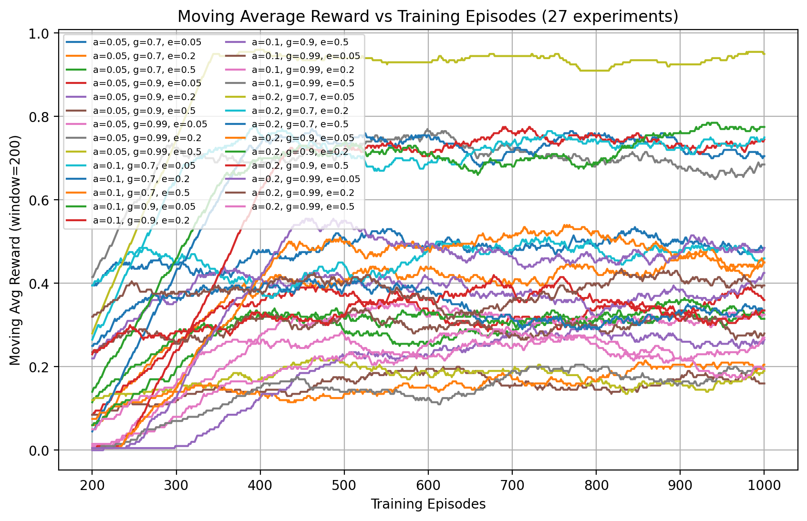
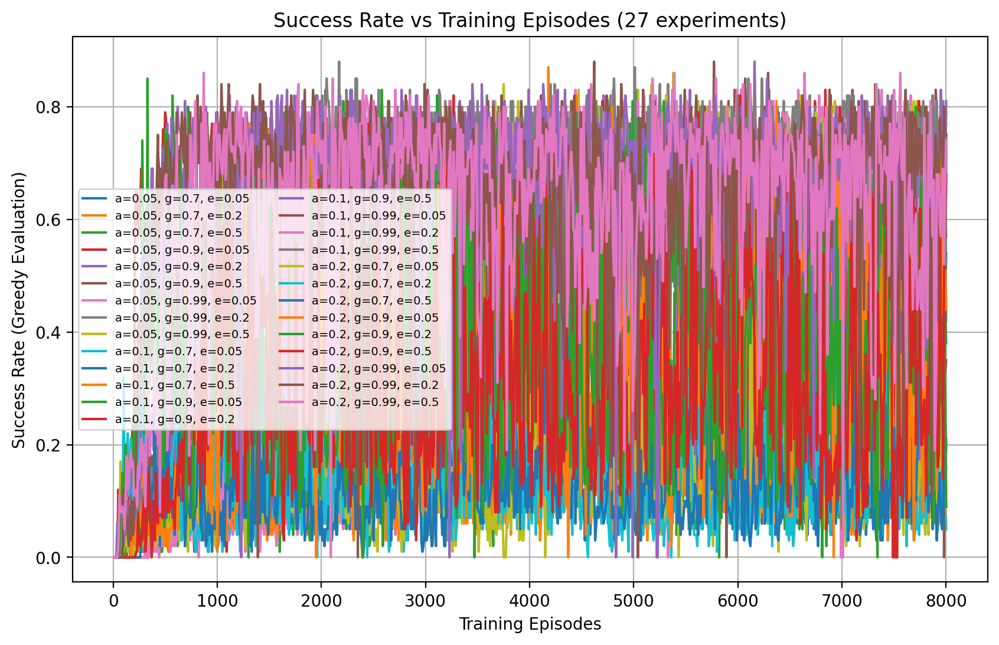
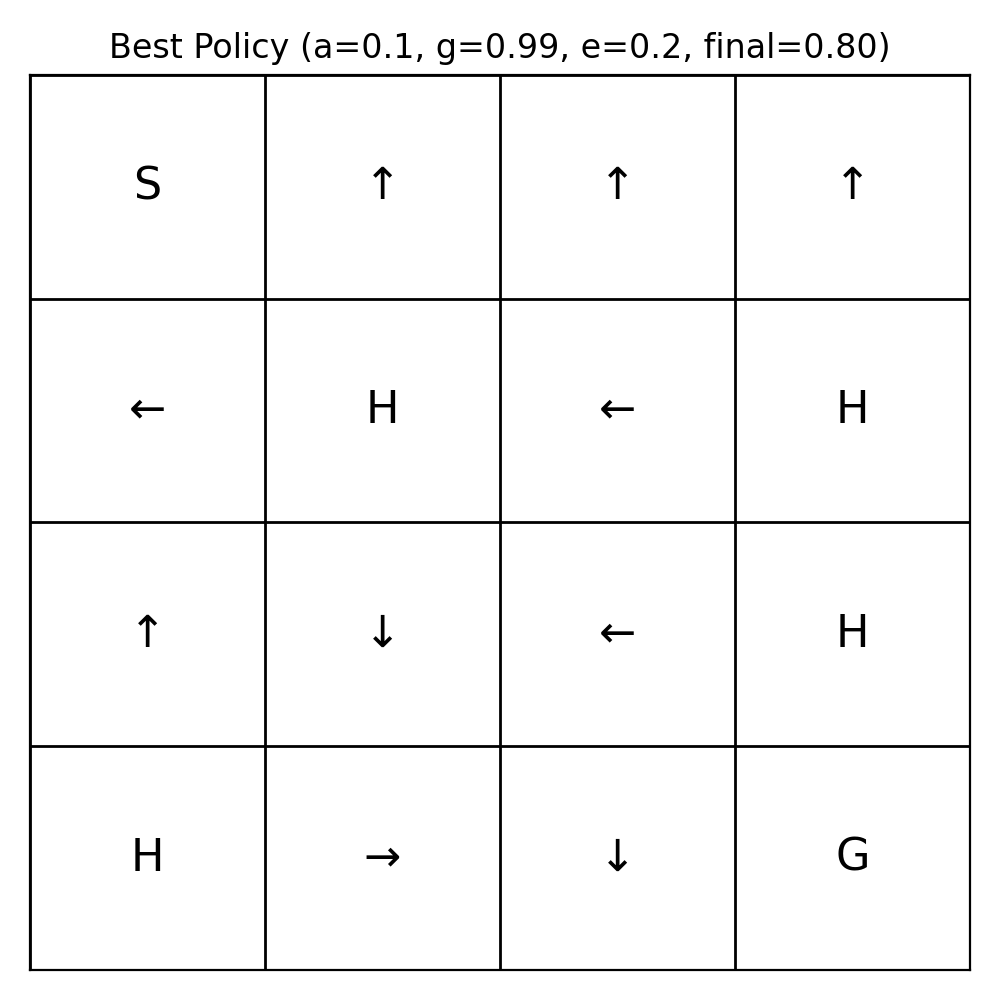

# 🧊 FrozenLake – Tabular Q-Learning (From Scratch)

**Author:** Omar Shaqaqi  
**Environment:** FrozenLake-v1 (Gymnasium)  
**Method:** Tabular Q-Learning  

---

## 🚀 Project Overview

This project implements **tabular Q-learning from scratch** to solve the classic **FrozenLake-v1** environment from Gymnasium.

The objective is to:

- Understand the agent–environment interaction loop  
- Implement the Q-learning update rule manually  
- Analyze the impact of varying:
  - Learning rate (α)
  - Discount factor (γ)
  - Exploration rate (ϵ)  
- Compare performance across multiple hyperparameter combinations  

The implementation was written manually to deeply understand how Q-learning works internally.

---

## 🧠 Environment Description

FrozenLake is a 4×4 grid-world Markov Decision Process (MDP):

- `S` – Start state  
- `F` – Frozen (safe state)  
- `H` – Hole (terminal, reward = 0)  
- `G` – Goal (terminal, reward = 1)  

Actions:
- 0 → Left  
- 1 → Down  
- 2 → Right  
- 3 → Up  

Training was performed using:

FrozenLake-v1 (is_slippery=False)

---

## 📦 Installation

Create and activate a virtual environment (recommended with Anaconda):

conda create -n rl_qlearn python=3.10 -y  
conda activate rl_qlearn  

Install dependencies:

pip install gymnasium numpy matplotlib  

Verify installation:

python -c "import gymnasium, numpy, matplotlib; print('Installation successful')"

---

## ▶️ Running the Project

Run the main training script:

python qlearning_frozenlake.py  

The script will:

- Train the Q-learning agent  
- Evaluate the greedy policy (ϵ = 0)  
- Generate performance plots  
- Save result images  

---

## 🧪 Experiments

### 🔹 Random Policy Baseline

A purely random policy was evaluated over 100 episodes.

Result:  
Success rate ≈ 0.01  

As expected, random exploration rarely reaches the goal.

---

### 🔹 Q-Learning Experiments

A 3×3×3 grid search was performed over:

| Parameter | Values |
|------------|---------|
| α (learning rate) | 0.05, 0.1, 0.2 |
| γ (discount factor) | 0.7, 0.9, 0.99 |
| ϵ (exploration rate) | 0.05, 0.2, 0.5 |

Total experiments: **27**

Each configuration was evaluated using:

- Greedy policy (ϵ = 0)  
- 100 independent evaluation episodes  

---

## 📊 Results

### 1️⃣ Moving Average Reward (27 Experiments)

Shows convergence behavior and learning stability.

---

### 2️⃣ Success Rate vs Training Episodes (27 Experiments)

Illustrates convergence speed and stability.

---

### 🏆 Best Performing Configuration

α = 0.05  
γ = 0.7  
ϵ = 0.05  

Final Success Rate = 1.00  

---

### 3️⃣ Learned Greedy Policy (Best Model)

This policy achieves 100% success rate under deterministic dynamics.

---

## 📈 Observations

- Lower exploration rates (ϵ ≤ 0.1) converge faster in deterministic environments.  
- Higher discount factors (0.9–0.99) improve long-term planning.  
- Larger learning rates may introduce instability.  
- States not visited under the optimal path may show arbitrary arrows (since their Q-values remain near zero).

---

## 🏗️ Project Structure

├── QLearning.py  
├── qlearning_frozenlake.py  
├── frozen_lake_random_policy.py  
├── policy_plot_best.png  
├── success_rate_27.png  
├── moving_avg_reward_27.png  
└── README.md  

---

## 🧮 Q-Learning Update Rule

Q(s,a) ← Q(s,a) + α [ r + γ maxₐ′ Q(s′,a′) − Q(s,a) ]

Exploration strategy: ϵ-greedy.

---

## 📌 Key Takeaways

- Tabular Q-learning reliably solves deterministic FrozenLake.  
- Hyperparameter tuning significantly affects convergence speed.  
- Visualizing both reward curves and success rates provides insight into stability and learning dynamics.  
- Even small discrete environments clearly demonstrate core reinforcement learning principles.

---

## 👨‍💻 Author

**Omar Shaqaqi**  
MSc Robotics & Autonomous Systems  
KFUPM  

GitHub: https://github.com/OmarShaqaqi/RL-frozenLake